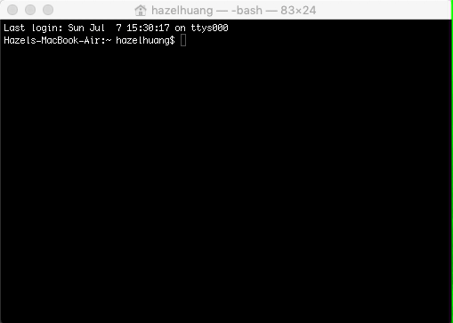

# Tiny Farm

A text-based farm simulation game which runs in the terminal.
Written in C++ for an Object-Oriented Programming course.

## Installation
1. Clone or download this repository to your local machine.
2. Open your terminal or command-line interface and change directories to the cloned/downloaded repository.
3. Invoke the 'make main'command while in the directory.
4. Run the newly created executable file 'main' by typing './main'.
5. Read instructions and enjoy farming!

NOTE: This game was written and tested using macOS, and with the inclusion of the makefile, compilation and executing the program will only work on UNIX and Linux based computers at this time.

